# REDCap Entity Developers Guide

[](https://zenodo.org/badge/latestdoi/137758590)

This document describes how to use REDCap Entity to create, store, manage and present novel data types in REDCap.

## Introduction

This module was designed to help teams that needs to create and manage additional content in REDCap that cannot be expressed as regular data entries (e.g. protocols, drugs, sites, prescriptions, papers, etc).

To develop this kind of feature, a few tasks need to be addressed such as:

- Design the data structure
- Choose the storage method/location
- Adopt and implement a data input workflow
- Implement data view

REDCap Entity is a powerful tool to address these tasks. Here is an example of an admin UI that can be generated via this module:


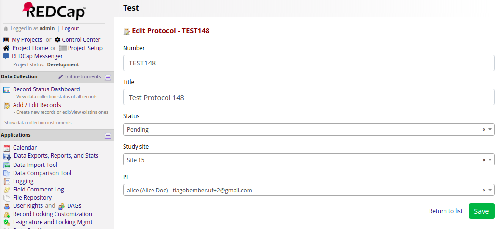

Most of what you see on images above is configurable: the labels, the columns, the data types, the available operations, the filters, the page size, even the icon!

UF's CTS-IT team has successfully developed 2 modules using REDCap Entity:

- [Project Ownership](https://github.com/ctsit/project_ownership)
- [REDCap OnCore Client](https://github.com/ctsit/redcap_oncore_client)

## How it works

This module is a developer's tool, so in order to design entity types, you need to create a new module that contains a hook (which defines your entity structure) and a less-than-10-line plugin (to render the list or your admin UI).

Advanced customizations are also possible by extending the PHP classes provided by this module.

## Where entities are stored
The entities are stored into DB tables prefixed with `redcap_entity_`. Example: given a `protocol` entity type, its DB table is named as `redcap_entity_protocol`.

Tables creation/removal can be managed via an [UI provided by this module](#alternative-1-via-ui) (only accessible by admins) or [programmatically triggered](#alternative-2-programmatically) via one-time hooks such as `redcap_module_system_enable()`.

The next sections will walk you through the process of designing and managing your entities.

**Important:** all code examples to be explored have been wrapped up and placed at [`examples/protocols_basic_v0.0.0`](examples/protocols_basic_v0.0.0) and [`examples/protocols_advanced_v0.0.0`](examples/protocols_advanced_v0.0.0) folders, which are external modules that can be used as templates to develop your own entities.

## Setting up entity types

### Step 1. Create your external module

REDCap Entity does not create entities by itself. It requires a **child module** to define the structure of your entities.

Let's call our example module "REDCap Protocols".

config.json

```json
{
    "name": "REDCap Protocols",
    "authors": [
        {
            "name": "Your name",
            "email": "youremail@example.com",
            "institution": "Your institution"
        }
    ],
}
```

Obs.: if you are not familiar with External Modules development, check [this documentation](https://github.com/vanderbilt/redcap-external-modules).


### Step 2. Implement `redcap_entity_types()`

Your entity type is defined on `redcap_entity_types` hook. There, you essentially specify:

- a label (e.g. "Protocol")
- the properties of your entity (e.g. title, status, PI, study site)
- additional settings (to be explored later on)

In our study case we are going to define 2 entities - Study site and Protocol.

ExternalModule.php

```php
<?php

function redcap_entity_types() {
    $types = [];

    $types['study_site'] = [
        'label' => 'Study site',
        'label_plural' => 'Study sites',
        'icon' => 'home_pencil',
        'properties' => [
            'name' => [
                'name' => 'Name',
                'type' => 'text',
                'required' => true,
            ],
            'address' => [
                'name' => 'Address',
                'type' => 'long_text',
                'required' => true,
            ],
            'contact_email' => [
                'name' => 'Contact email',
                'type' => 'email',
                'required' => true,
            ],
        ],
        'special_keys' => [
            'label' => 'name', // "name" represents the entity label.
        ],
    ];

    $types['protocol'] = [
        'label' => 'Protocol',
        'label_plural' => 'Protocols',
        'icon' => 'codebook',
        'properties' => [
            'number' => [
                'name' => 'Number',
                'type' => 'text',
                'required' => true,
            ],
            'title' => [
                'name' => 'Title',
                'type' => 'text',
                'required' => true,
            ],
            'status' => [
                'name' => 'Status',
                'type' => 'text',
                'default' => 'pending',
                'choices' => [
                    'in_study' => 'In Study',
                    'pending' => 'Pending',
                    'expired' => 'Expired',
                ],
                'required' => true,
            ],
            'created_by' => [
                'name' => 'Created by',
                'type' => 'user',
                'required' => true,
            ],
            'project_id' => [
                'name' => 'Project ID',
                'type' => 'project',
                'required' => true,
            ],
            'study_site' => [
                'name' => 'Study site',
                'type' => 'entity_reference',
                'entity_type' => 'study_site',
            ],
            'pi' => [
                'name' => 'PI',
                'type' => 'user',
            ],
        ],
        'special_keys' => [
            'label' => 'number', // "number" represents the entity label.
            'project' => 'project_id', // "project_id" represents the project which the entity belongs to.
            'author' => 'created_by', // "created_by" represents the entity author's username.
        ],
    ];

    return $types;
}
```

#### label

Defines the label of your entity type.

#### label_plural

Defines the plural label of your entity type.

#### icon

Defines the icon that best describes your entity type. Valid icons can be found on REDCap images folder: `Resources/images`. Leave the file extension out when using this setting, e.g. to choose "codebook.png" file, type "codebook" only.

#### properties

By default, every entity has 3 properties:

- `id`:  internal auto-incremented integer ID
- `created`: [Epoch time](https://en.wikipedia.org/wiki/Unix_time) of entity creation
- `updated`: [Epoch time](https://en.wikipedia.org/wiki/Unix_time) of entity last update

By setting `properties`, you are adding custom properties to your entity type. It is expected to be an array of property definitions, keyed by identifiers. There are 2 required settings for each definition: **name** and **type**. Example:

```php
<?php

'properties' => [
    'title' => [
        'name' => 'Title',
        'type' => 'text',
    ],
    'description' => [
        'name' => 'Description',
        'type' => 'long_text',
    ],
]
```

The property type specifies the data type, which helps the form builder (see details on [Building an entity list / admin UI](#building-an-entity-list-admin-ui) section) to render input fields and validate data submission. Here is a list of valid types:

- `text`
- `long_text`
- `integer`
- `date`: stored as [Epoch time](https://en.wikipedia.org/wiki/Unix_time)
- `json`
- `project`: use this type to reference a REDCap project
- `email`
- `user`: use this type to reference a REDCap user
- `data`: sets up a hidden field for storage purposes only, that supports large amounts of data (e.g. serialized arrays, complex structures)
- `entity_reference`: other entities can be referenced via this type, which requires an extra key - `entity_type`, defining the target entity type. Example (protocol referencing study site):

```php
<?php

'study_site' => [
    'name' => 'Study site',
    'type' => 'entity_reference',
    'entity_type' => 'study_site',
],
```

If your property is required, you can enable `required` setting. Example:

```php
<?php

'number' => [
    'name' => 'Number',
    'type' => 'text',
    'required' => true,
],
```

If your property needs to be presented as a list of options, you may set `choices` - a setting that expects an array of labels, keyed by option values. Example:

```php
<?php

'status' => [
    'name' => 'Status',
    'type' => 'text',
    'choices' => [
        'in_study' => 'In study',
        'pending' => 'Pending',
        'expired' => 'Expired',
    ],
],
```

Alternatively, you can set `choices_callback`, a setting that expects a callable string (i.e. function name, class method, etc.) that returns the same `choices` structure. There are 2 types of lists: "dropdown" and "radios", which can be set via `choices_type`. `choices_type` works with both `choices` and `choices_callback`.  If `choices_type` is left blank, "dropdown" is set. Example:

```php
<?php

'status' => [
    'name' => 'Status',
    'type' => 'text',
    'choices_callback' => 'MyCustomModule::getStatusList',
    'choices_type' => 'radios',
],
```

Use `default` to set a default value to your property. Reference the default value by the choices key. Example:

```php
<?php

'status' => [
    'name' => 'Status',
    'type' => 'text',
    'default' => 'in_study',
    'choices' => [
        'in_study' => 'In study',
        'pending' => 'Pending',
        'expired' => 'Expired',
    ],
],
```

#### special_keys

This setting is used to add semantics to your properties, i.e. you are telling REDCap Entity that a field has a special meaning. There are 3 special keys available:

- `label`: Use this setting if a property represents the label of your entity (e.g. Name, Title, etc). If not set, REDCap Entity takes the internal (auto-incremented) ID as the default label.
- `project`: Use this setting if a property represents the project ID that your entity belongs to. By doing that, a few features are enabled:
  - When the entity is created, the property is automatically populated with the current project ID.
  - An entity that belongs to project *A* cannot be accessed by project *B*, and vice-versa.
- `author`: Use this setting to tell REDCap Entity that the given property should store the content author. By doing that, the field is automatically filled with the current user's username on entity creation.

Extracted from Protocol example:

```php
<?php

'special_keys' => [
    'label' => 'number', // "number" represents the entity label.
    'project' => 'project_id', // "project_id" represents the project which the entity belongs to.
    'author' => 'created_by', // "created_by" represents the entity author's username
],
```

Obs.: Make sure the data types of the referenced properties are correct - they should be  `text`, `project`, and `user` for `label`, `project`,  and `author` respectively.

#### class

This setting will be approached on [Customizing the Business Logic](#customizing-entity-business-logic) section.

#### form_class

This setting will be approached on [Customizing Entity Form](#customizing-entity-form) section.

### Step 3. Firing up database tables

#### Alternative 1: Via UI

Go to **Control Center > Entity DB Manager** - you will be able to see your entity types.


Once you hit "create db table" for each one of your entity types - and proceed with the confirmation modal - a new db table is created, and your entity type is finally enabled!

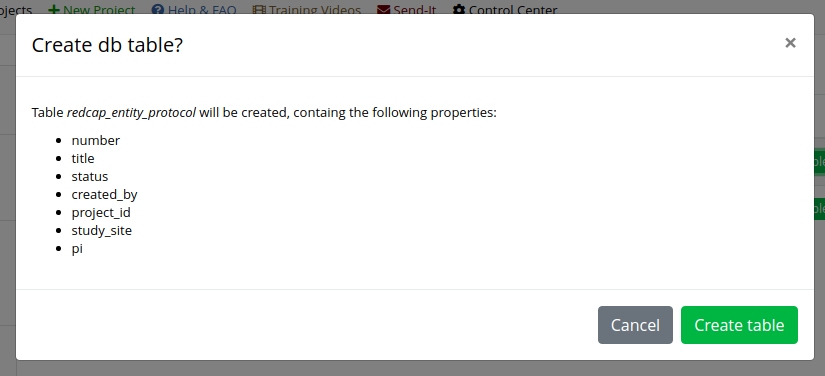

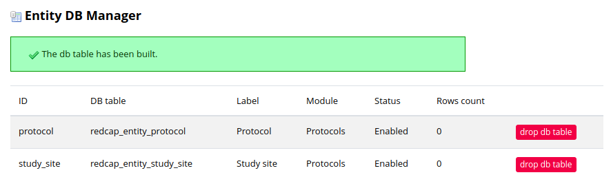

In the same way, you can drop the table by clicking on "delete db table" and proceed with the confirmation modal.

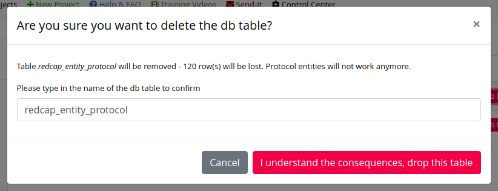

**Important:** During your design/dev process you can troubleshoot your `hook_entity_type()` definitions. If there is something wrong with your definition arrays, your entity type is listed as "Invalid", and you can see a list of issues to be addressed.


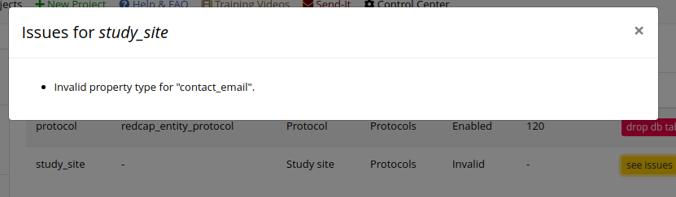

#### Alternative 2: Programmatically

If you want to skip the manual creation via UI and trigger your table creation on module enable, add the following code to your external module class:

```php
<?php

function redcap_module_system_enable($version) {
    \REDCapEntity\EntityDB::buildSchema($this->PREFIX);
}
```

Don't forget to allow `redcap_module_system_enable()` hook on config.json:

```json
{
   "permissions": [
       "redcap_module_system_enable"
   ]
}
```

Don't worry about re-enabling your module multiple times - if the table already exists, nothing happens to it. If you want to rebuild/reset your table for every enable event, you can do it by setting `buildSchema` 2nd parameter:

```php
<?php

\REDCapEntity\EntityDB::buildSchema($this->PREFIX, true)
```

So far we have covered the data structure design and the storage method. Let's now move forward to data input and visualization.

### Step 4. Building an entity list / admin UI

#### Step 4.1. Defining links on config.json

Let's create 2 page links: one for study sites (to be accessible via Control Center) and another one for protocols (available only within projects):

config.json

```
"links": {
    "control-center": [
        {
            "name": "Study sites",
            "icon": "home_pencil",
            "url": "plugins/study-sites.php"
        }
    ],
    "project": [
        {
            "name": "Protocols",
            "icon": "codebook",
            "url": "plugins/protocols.php"
        }
    ]
}
```

Here is the "Study sites" link, accessible from Control Center:

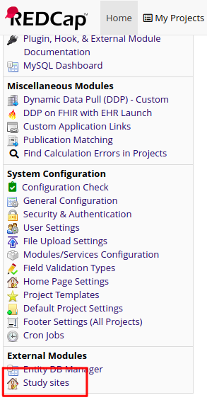

Here is the "Protocols" link - make sure Protocols module is enabled for the given project, otherwise the link won't show up:

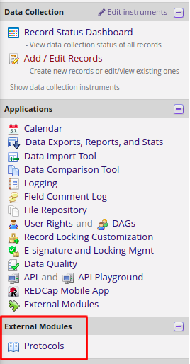

#### Step 4.2. Creating the plugins

The links won't work without plugins that build and render their respective pages. Let's create the files referenced on the previous step, starting with Study sites page.

pages/study-sites.php

```php
<?php

use REDCapEntity\EntityList;

$list = new EntityList('study_site', $module);
$list->setOperations(['create', 'update', 'delete']) // Enabling all operations.
    ->render('control_center'); // Context: Control Center.
```

By clicking on "Study sites" link, we can see the following result:

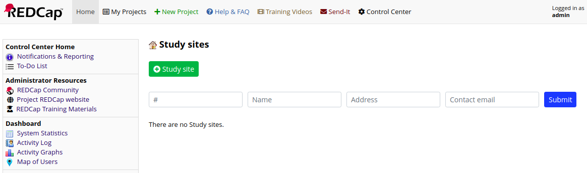

We can add a new study site by clicking on "+ Study site" button

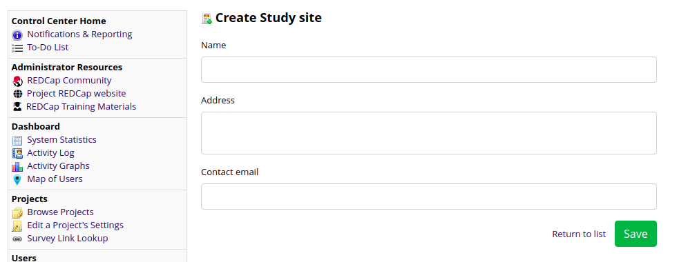

The form builder handles input validation, based on the data structure. Here is an example of error handling:

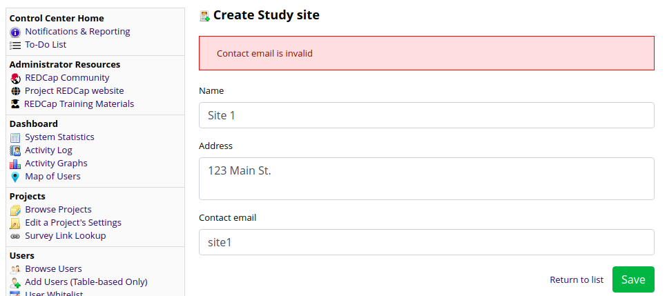

And here is the result after a sucessful submit:

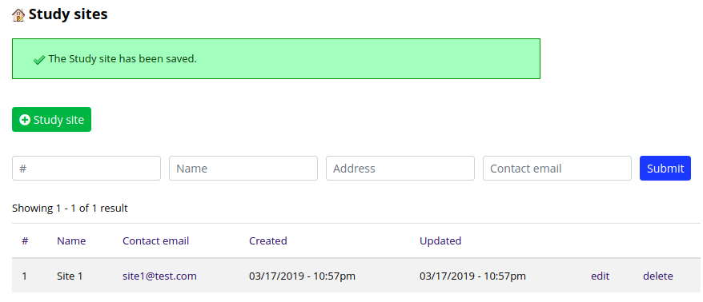

Analogously, let's create pages/protocols.php file

```php
<?php

use REDCapEntity\EntityList;

$list = new EntityList('protocol', $module);
$list->setOperations(['create', 'update', 'delete'])
    ->render('project'); // Context: project.
```

Here is the result by clicking on "Protocols" link.

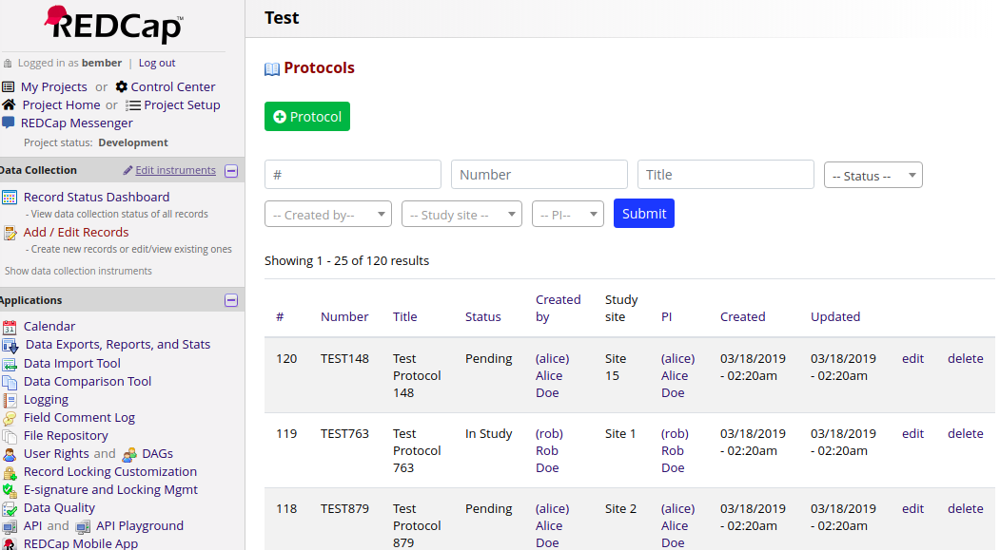

Besides `setOperations()`, there is a series of customizations that can be done, summarized on the example below:

```php
<?php

use REDCapEntity\EntityList;

$list = new EntityList('protocol', $module);
$list->setOperations(['create', 'update'])
    ->setCols(['number', 'title', 'status']) // Set fields to display.
    ->setSortableCols(['number', 'title']) // Set columns to be sortable.
    ->setExposedFilters(['created_by', 'study_site']) // Set exposed filters.
    ->setBulkDelete() // Enable delete bulk operation.
    ->setPager(5, 5) // Set page and pager sizes.
    ->render('project'); // Context: project.
```

And here is the result (compare it with the previous):


Obs.: there is a 3rd possible context besides control center and projects: "global", which is the same context of pages like Home, My Projects, etc. [Project Ownership](https://github.com/ctsit/project_ownership) module is a good example of global context usage.

For further information, you may open `classes/EntityList.php` file and explore the `EntityList` class methods that you can use. For advanced needs which `EntityList` cannot cover, you can extend this class and use your own class instead. [Project Ownership](https://github.com/ctsit/project_ownership) module is a good example of advanced customization.

## Manipulating your entities programmatically

#### Create

```php
<?php

$factory = new \REDCapEntity\EntityFactory();
$entity = $factory->create('protocol', [
    'number' => 'TEST123',
    'title' => 'Test Protocol',
    'status' => 'in_study',
    'project_id' => 14,
    'study_site' => 5,
    'pi' => 'alice',
]);

echo $entity->getId();
```

#### Retrieve

```php
<?php

$factory = new \REDCapEntity\EntityFactory();
$entity = $factory->getInstance('protocol', 1);

// Print entity data.
print_r($entity->getData());
```

To retrieve multiple entities, you can pass a list of IDs to `loadInstances()`:

```php
<?php

$factory = new \REDCapEntity\EntityFactory();
$entities = $factory->loadInstances('protocol', [1, 2, 3]);

// Print entities data.
foreach ($entities as $entity) {
    print_r($entity->getData());
}
```

#### Update

```php
<?php

if ($entity->setData(['status' => 'expired', 'pi' => 'pi_user'])) {
    $entity->save();
}
else {
    // Get a list of properties that failed on update
    print_r($entity->getErrors());
}
```

#### Delete

```php
<?php

$entity->delete();
```

#### Query entities

To query entities, there is no need to use SQL - you may use the provided query framework. For instance, the code above retrieves protocol objects, filtered by PIs that match the current user, sorting results by title:

```php
<?php

$factory = new \REDCapEntity\EntityFactory();
$results = $factory->query('protocol')
    ->condition('pi', USERID)
    ->orderBy('title')
    ->execute();
```

For further information, you may see `classes/EntityQuery.php` file to explore the `EntityQuery` class methods that you can use.

## Customizing entity business logic

To customize the business logic of your entity, you may extend the `Entity` class, which is the default class used to instantiate entities. There are 2 steps to do it:

#### Step 1. Reference your class on `redcap_entity_types()`:

In our example, the class is named `Protocol`, located at `classes/Protocol.php`.

```php
$types['protocol'] = [
    'class' => [
        'path' => 'classes/Protocol.php', // Autoloads class file.
        'name' => 'REDCapProtocols\Protocol',
    ],
```

#### Step 2. Create your entity class

classes/Protocol.php

```php
<?php

namespace REDCapProtocols;

use REDCapEntity\Entity;

class Protocol extends Entity {
    function approve() {
        $this->setData(['status' => 'in_study']);
        $this->save();
    }
}
```

For further information, you may open `classes/Entity.php` file and explore the `Entity` class methods that you can override.

#### Bonus: Adding custom bulk operations

Besides adding "Delete" bulk operation on entity lists via `setBulkDelete()`, it is possible to create custom bulk operations via `setBulkOperation()`. Let's take `approve()` method from this section as an example:

```php
<?php

use REDCapEntity\EntityList;

$list = new EntityList('protocol', $module);
$list->setBulkDelete()
    ->setBulkOperation('approve', 'Approve Protocols', 'The protocols have been approved', 'green')
    ->render('project'); // Context: project.
```

Here is the result:

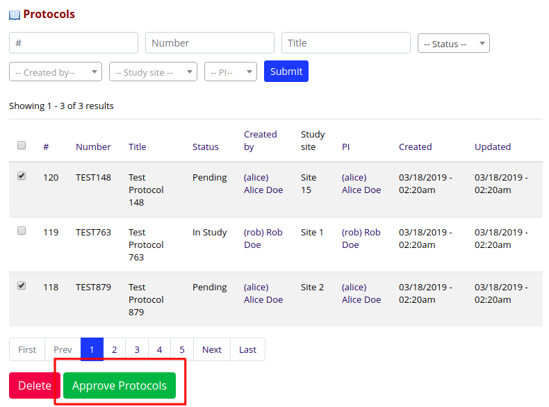

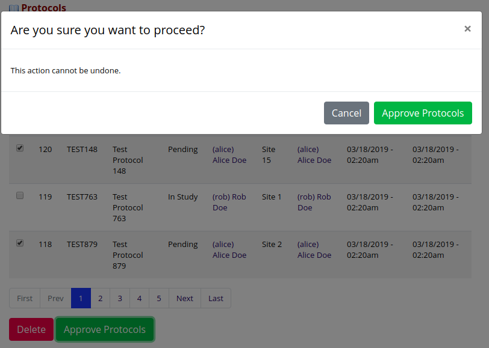

Note how the protocols status have been affected:

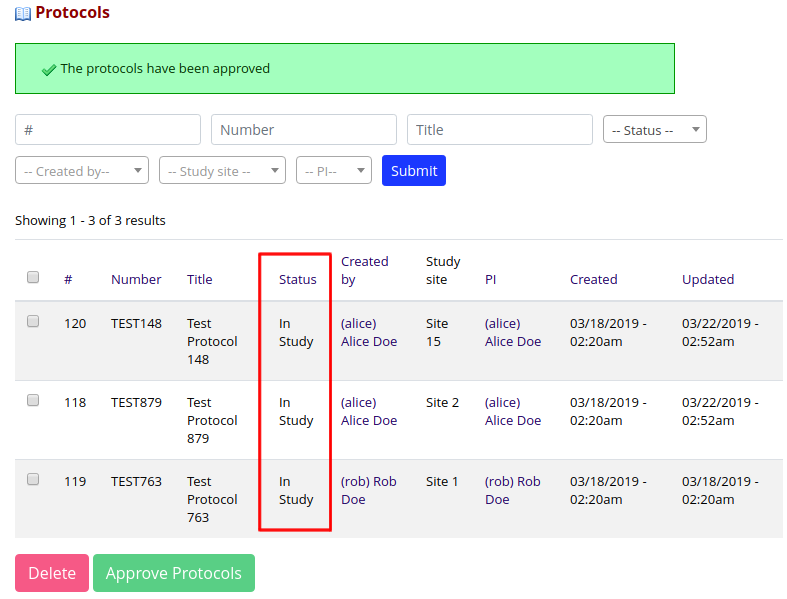

Here is a detailed description of `setBulkOperation($method, $label, $message, $btn_color)` parameters:

* `method`: The entity method that applies the operation.
* `label`: The button label.
* `message`: The status message to be displayed when the bulk operation is completed, e.g. "The items have been processed.".
* (optional) `btn_color`: The button color. Available options: `green`, `yellow`, `red`, `black`, `gray`, `white`, `light_blue`. Defaults to `blue`.

## Customizing the entity form

You can customize your entity creation/edit form according to your needs. It's a quite analogous procedure to [customizing entity's business logic](#customizing-entity-business-logic) - to do that, you need to create a class (that extends `EntityForm`) and reference it on `hook_entity_types`.

#### Step 1. Reference your class on `redcap_entity_types()`:

In our example, the class is named `ProtocolForm`, located at `classes/ProtocolForm.php`.

```php
$types['protocol'] = [
    'form_class' => [
        'path' => 'classes/ProtocolForm.php', // Autoloads class file.
        'name' => 'REDCapProtocols\ProtocolForm',
    ],
```

#### Step 2. Create your form class

`ProtocolForm` customizes the default protocol form as follows:

- Changes submit button text to "Submit Protocol".
- Adds a helper text at the top of the form.
- Sets "Title" as the 1st field.
- Adds a CSS file that turns all fields labels into bold.
- Adds a JS file that makes "Number" read-only after the protocol is created.

classes/ProtocolForm.php

```php
<?php

namespace REDCapProtocols;

use ExternalModules\ExternalModules;
use REDCapEntity\EntityForm;

class ProtocolForm extends EntityForm {
    protected function getSubmitLabel() {
        return 'Submit Protocol';
    }

    protected function renderPageBody() {
        // Adds helper text.
        echo '<div class="yellow helper-info">Helper information about this form.</div>';

        // Adds assets.
        $this->cssFiles[] = ExternalModules::getUrl('protocols', 'css/protocol_form.css');
        $this->jsFiles[] = ExternalModules::getUrl('protocols', 'js/protocol_form.js');

        parent::renderPageBody();
    }

    protected function buildFieldsInfo() {
        parent::buildFieldsInfo();

        // Sets "Title" as the 1st field.
        $title = $this->fields['title'];
        unset($this->fields['title']);
        $this->fields = ['title' => $title] + $this->fields;
    }
}
```

Here are the CSS and JS files that complete our example:

css/protocol_form.css

```css
#entity-form label {
    font-weight: bold;
}
```

js/protocol_form.js

```javascript
$(function() {
    var $number = $('#entity-form [name="number"]');

    if ($number.val()) {
        // Disables "Number" field when it is already set.
        $number.attr('disabled', '');
    }
});
```

Here are the results - before:

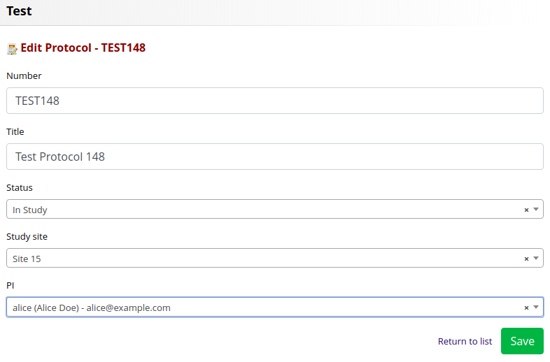

After:

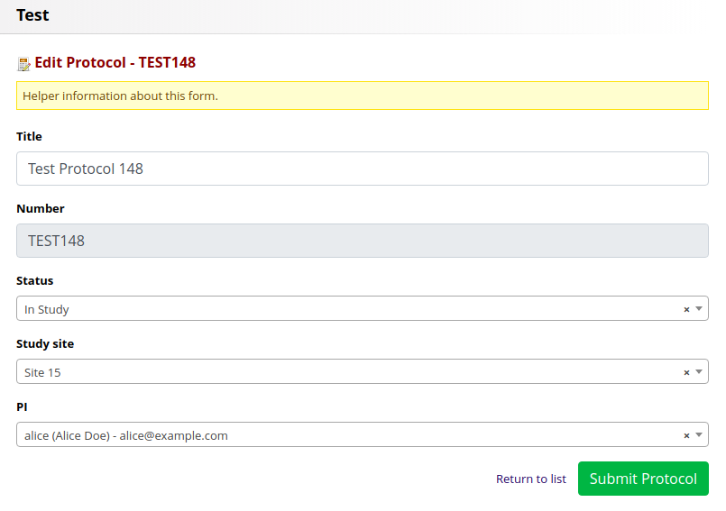
