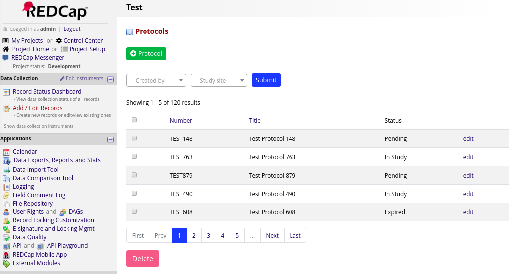
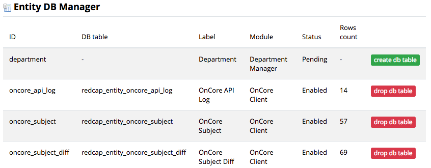

# REDCap Entity

Provides features to design, store and manage custom entities in REDCap.

## Prerequisites

- REDCap >= 8.7.0

## Easy Installation
REDCap Entity is available in the [REDCap Repo](https://redcap.vanderbilt.edu/consortium/modules/index.php).  To install it follow these steps:

- Access your REDCap installation's _View modules available in the REDCap repo_ button at **Control Center > External Modules** to download _REDCap Entity_.
- Once download, enable REDCap Entity. The module will be enabled globally.

## Manual Installation
- Clone this repo into `<redcap-root>/modules/redcap_entity_v<version_number>`.
- Go to **Control Center > External Modules** and enable REDCap Entity. The module will be enabled globally.

## Introduction

REDCap Entity is a software development library that simplifies the development of REDCap External Modules by providing tools to design, store, manage, enter, view and edit data entities needed by a REDCap Module. This module is a _dependency_ for other modules such as UF CTS-IT's [REDCap Project Ownership](https://github.com/ctsit/project_ownership) and [REDCap OnCore Client](https://github.com/ctsit/redcap_oncore_client).

A module might need to manage a data type that does not exist in core REDCap. For example, [REDCap Project Ownership](https://github.com/ctsit/project_ownership) introduces the concept of a _project owner_.  This is a person who acts as owner/custodian for a project. These ownership details have to be stored, retrieved, displayed and edited. In some cases a large list of owners and related facts need to be displayed, filtered, and sorted.  REDCap Entity provides a set of functions a REDCap module developer can use to define the things to be stored as well as how they should be displayed.

REDCap Entity helps a developer define these details:

- The custom content storage. (e.g. it will create a SQL table)
- Implement a form to add/edit your content
- Implement a page that lists your content
- Implement features to help you navigate through the list like a pager, filters, etc.

REDCap Entity allows a moderate amount of code to add functionality that looks like this to a REDCap Module:

## Managing Entities

REDCap Entity will present an Entity DB Manager in the REDCap Control Panel. It gives an admin the ability to create or delete the data managed by REDCap Entity on a per-entity basis.

## Developing with REDCap Entity

A complete development guide for using REDCap Entity in your REDCap External Module is available at [REDCap Entity Developers Guide](README-developer.md).
